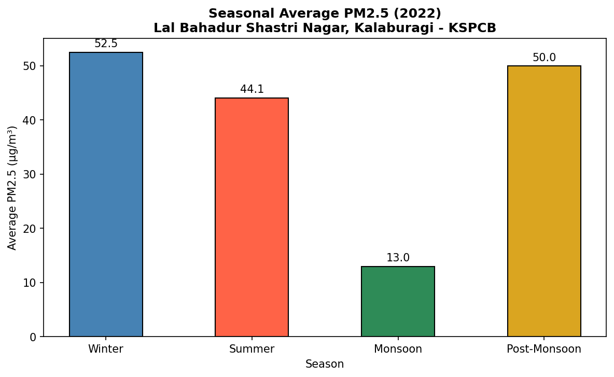
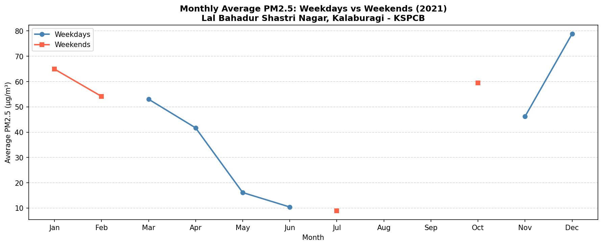
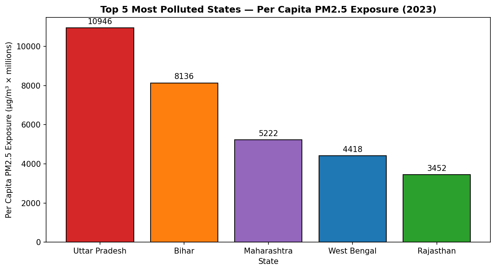
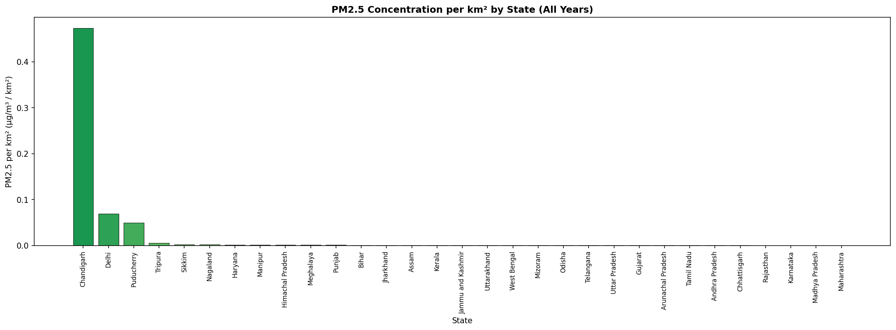
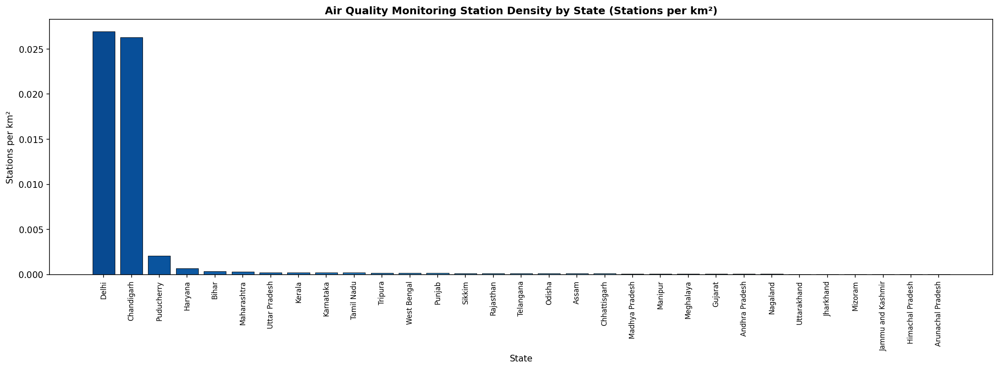
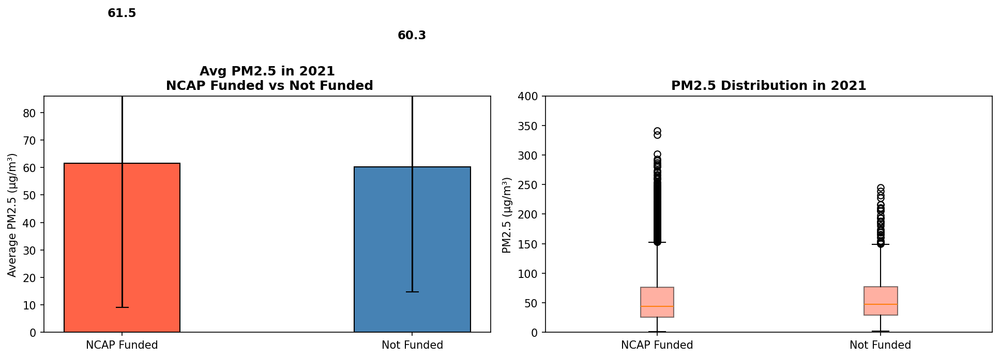
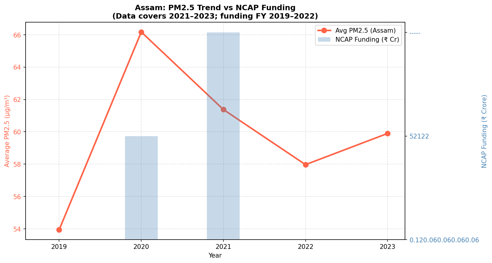
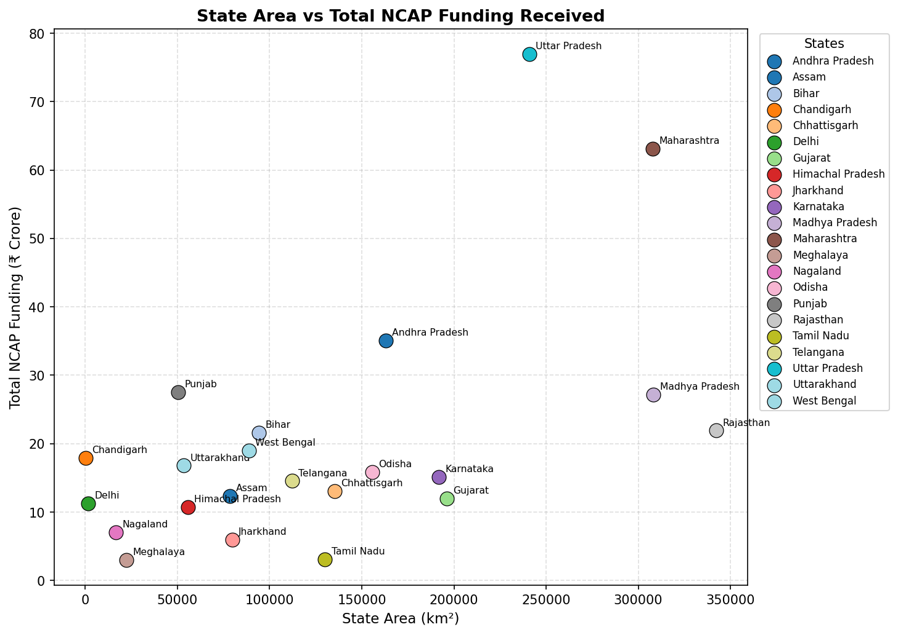
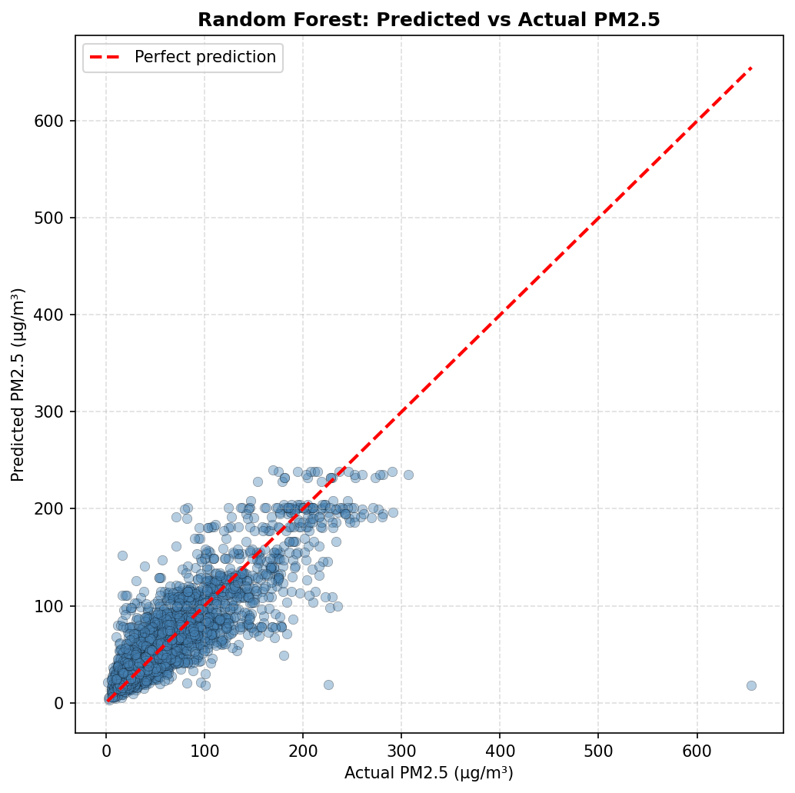
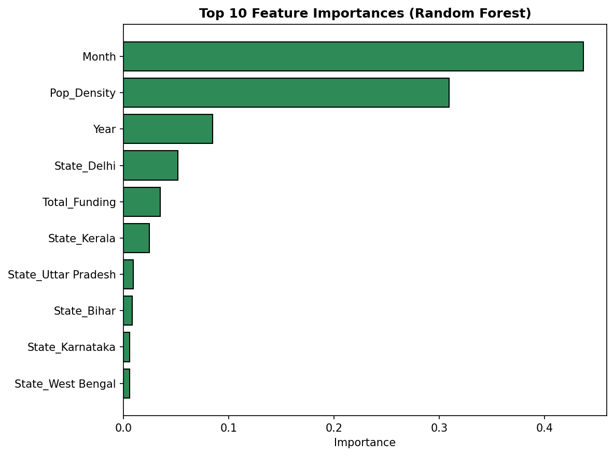

# India Air Quality Analysis (PM2.5) — 2021-2023

Analysis of PM2.5 pollution trends across Indian states using real monitoring
station data, state demographic data, and National Clean Air Programme (NCAP)
funding data. The project explores which states are most polluted, how
pollution varies seasonally and by weekday/weekend, whether NCAP funding
correlates with improved air quality, and builds a machine learning model to
predict PM2.5 levels.

## Tools & Libraries
Python · pandas · numpy · matplotlib · scikit-learn

## Data Sources
- Station-level PM2.5 air quality readings (CPCB monitoring network)
- State population & area data (Census of India)
- National Clean Air Programme (NCAP) funding disclosures

## Project Structure
```
india-air-quality-pm25-analysis/
├── data/
│   ├── Data.csv
│   ├── State_data.csv
│   └── NCAP_Funding.csv
├── outputs/              # saved chart images
├── air_quality_analysis.ipynb
├── requirements.txt
└── README.md
```

## Key Findings

- **Delhi** has the highest average PM2.5 across all years and stations
  (103.16 µg/m³) — nearly 22 µg/m³ higher than the next closest state
  (Bihar, 81.20 µg/m³) — and recorded the most hazardous-level days
  (>300 µg/m³) in 2023, with 5.
- **Assam** shows the highest inter-station variability in 2023
  (std = 39.41 µg/m³), meaning pollution differs sharply between
  monitoring stations within the same state.
- At the Kalaburagi station, **Winter** is the most polluted season
  (52.46 µg/m³ avg), while **Monsoon** is by far the cleanest
  (12.98 µg/m³) — consistent with rain washing out particulates and
  winter temperature inversions trapping pollutants near the ground.
- **Mizoram** had the lowest average PM2.5 in the Post-COVID period
  (2021-2022) at just 11.15 µg/m³.
- NCAP-funded states show almost **no measurable improvement** over
  non-funded states in 2021 (61.47 vs 60.27 µg/m³ average) — suggesting
  funding alone isn't sufficient without strong implementation and
  enforcement.
- A Random Forest model achieved an **R² of 0.732** (MAE 15.54),
  substantially outperforming a Linear Regression baseline (R² 0.241).
  5-fold cross-validation gave a more conservative mean R² of 0.416
  (± 0.215). **Month** and **population density** were the strongest
  predictors of PM2.5, together accounting for over 74% of the model's
  feature importance.

## Visualizations

### Seasonal Pollution Pattern (Kalaburagi, 2022)


### Weekday vs Weekend Trend (Kalaburagi, 2021)


### Top 5 States by Per-Capita PM2.5 Exposure (2023)


### Population Density vs PM2.5


### PM2.5 Concentration per km² by State


### Monitoring Station Density by State


### NCAP Funded vs Non-Funded States (2021)


### Assam: PM2.5 Trend vs NCAP Funding


### State Area vs Total NCAP Funding


### Model: Predicted vs Actual PM2.5


### Feature Importance (Random Forest)


## How to Run
```bash
git clone https://github.com/<arju109>/india-air-quality-pm25-analysis.git
cd india-air-quality-pm25-analysis
pip install -r requirements.txt
jupyter notebook air_quality_analysis.ipynb
```

## Author
Arju — https://github.com/arju109/india-air-quality-pm25-analysis
